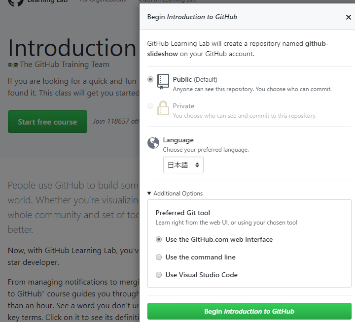

# References for data applications

An introduction for data applications.

石崎 2020/05/02

R, Python, Git, Markdown, Visual Studio Codeといったデータ処理に便利なアプリケーションに関する、有用なサイト等へのリンク集。

主にYouTube等の映像資料を中心に掲載した。

## R, RStudio

良い日本語の映像はあまり無い。

- https://www.youtube.com/watch?v=lL0s1coNtRk&t=1027s

    英語だし1.5時間ぐらいあるが、基礎から丁寧に説明してあり、これ一つ見れば概ね全体を理解できる。

## Python (Jupyter)

RStudio同様、日本語の良い映像はあまり見当たらない。

- https://www.youtube.com/watch?v=HW29067qVWk

    英語だが、最終的にどんな見栄えのものができるかを最初に紹介してあり、目標感がしっかりできて良い。但し作成が4年前でちょっと古い。

## Git, Github, Gitlab

- https://www.youtube.com/watch?v=j6sAaOqyk3Y

    TortoiseGitを使った初歩的な説明。ブランチ,スタッシュ,タグの紹介あり。

- [Github learning course](https://lab.github.com/githubtraining/introduction-to-github?overlay=register-box-overlay)

    Github本家の練習用サイト。かなり本格的。Start free courseをクリックすると言語を日本語にして開始できる。GithubとGitlabのインターフェースは違うが基本的なコンセプトについてはGithubで学んで問題ない。

    

## Markdown

- https://www.youtube.com/watch?v=wqjJquMS92Q

    5分の入門編。VSCodeやTyporaを使った場合についても説明してある。

- https://www.youtube.com/watch?v=XgdNFms5mhs

    5分。使っているエディタがAtomだが、

- https://www.youtube.com/watch?v=-OcP_FaZcQs

    20分。VSCodeを使った場合の説明。但し、レンダリングした画面がかなりcssでカスタマイズしてあり、そのcssの設定方法の説明もあるが、cssに説明が寄り過ぎ？
## VSCode

- https://www.youtube.com/watch?v=e3DmHK2PDGA

    15分。シリーズになっていてより詳しく学習することもできる。#4のマルチカーソルは必見。

- https://www.youtube.com/watch?v=-OcP_FaZcQs

    上記の通りMarkdownについても説明されている。日本語化の説明があるのは良い。
    Markdown all in one は確かにインストールしておいた方がいい。

## Excel (Table)

- https://www.youtube.com/watch?v=heiTq5cXYAc

    9分。テーブル機能の初歩

